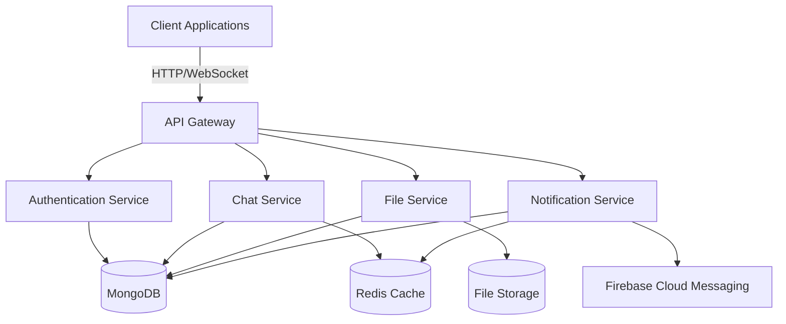
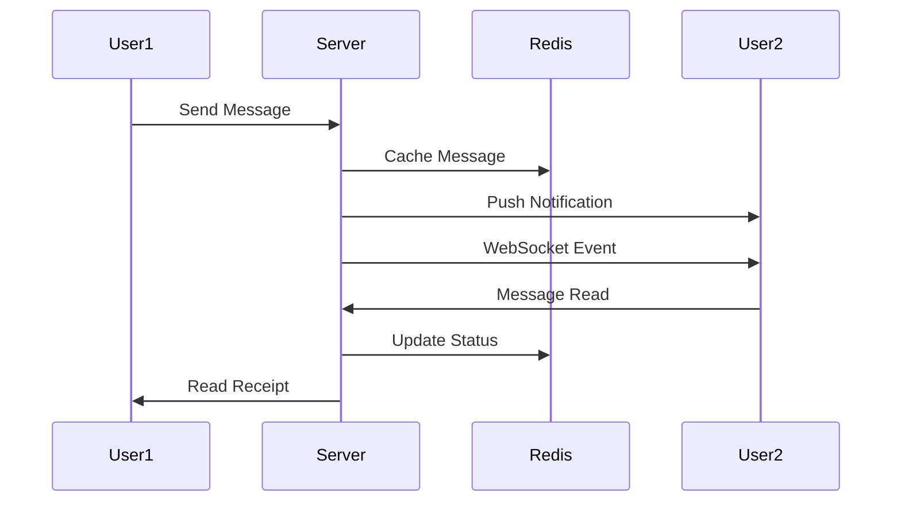
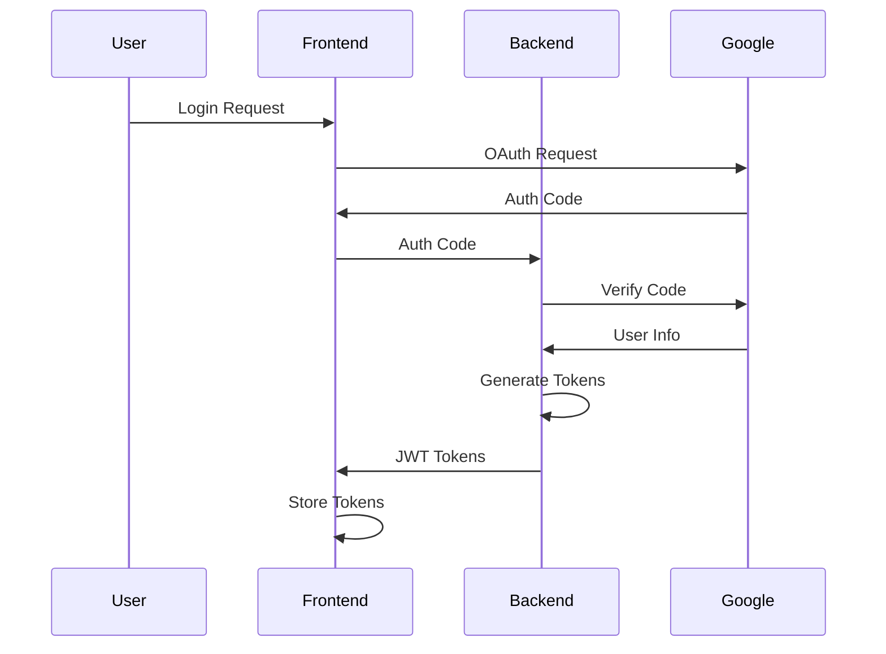
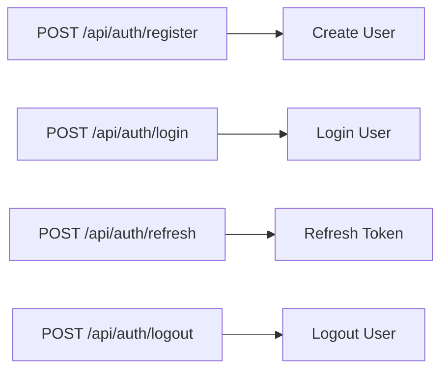
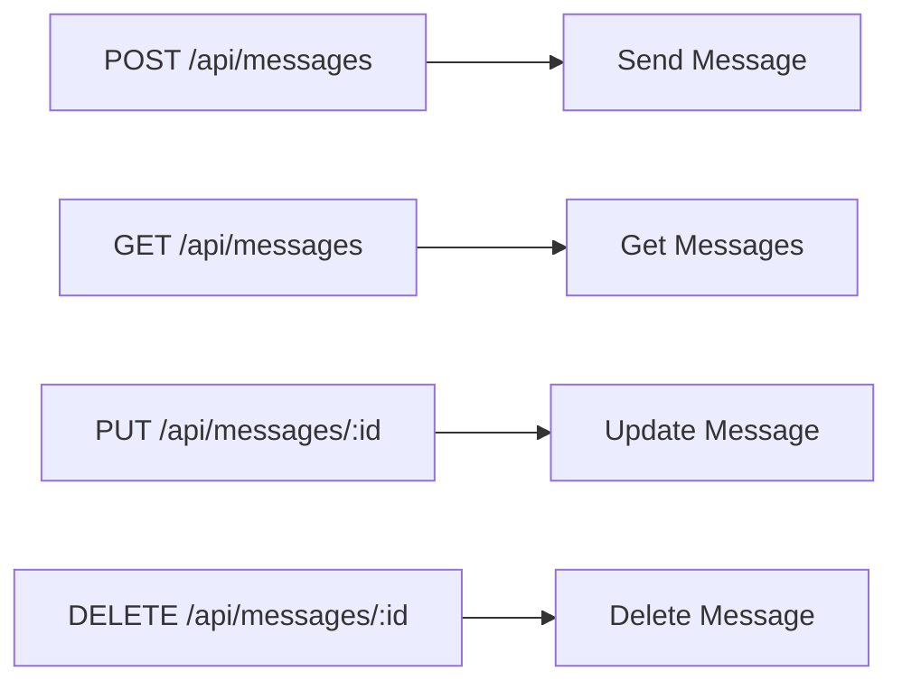
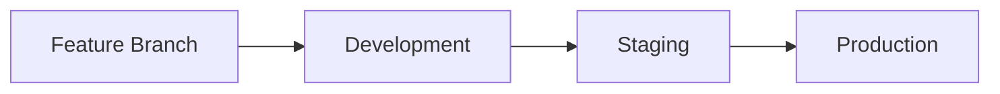
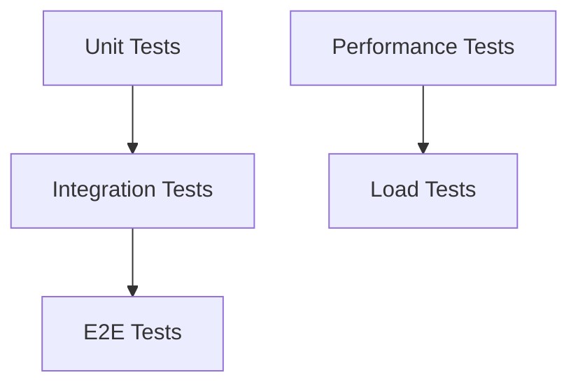
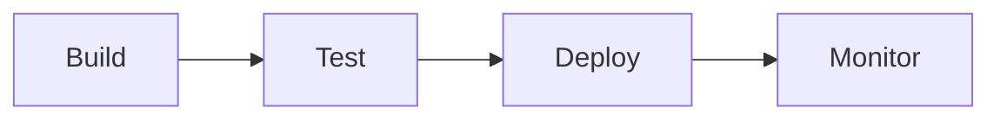
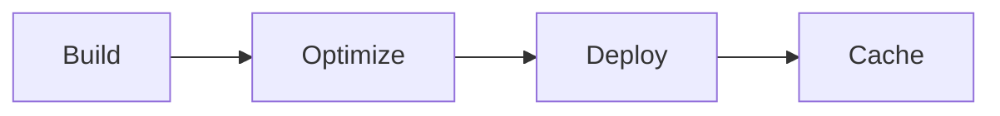

# NexusChat

A full-featured real-time chat application with advanced features like message encryption, file sharing, video calls, and more.

## Table of Contents
- [System Architecture](#system-architecture)
- [Features](#features)
- [Technology Stack](#technology-stack)
- [Prerequisites](#prerequisites)
- [Installation](#installation)
- [Environment Setup](#environment-setup)
- [Running the Application](#running-the-application)
- [API Documentation](#api-documentation)
- [Development Guidelines](#development-guidelines)
- [Testing](#testing)
- [Deployment](#deployment)
- [Contributing](#contributing)
- [License](#license)

## System Architecture

### High-Level Architecture


### Message Flow


### Authentication Flow


## Features

### Core Features
- Real-time messaging
- Group chats
- File sharing
- Voice messages
- Video calls
- Message encryption
- Message scheduling
- Message templates
- Message polls
- Message reactions
- Message threads
- Message forwarding

### Advanced Features
- Offline support
- Message translation
- Cloud backup
- Analytics
- User activity tracking
- Push notifications
- Desktop notifications
- Screen sharing
- Message search
- Message export
- Message archiving
- Message pinning

## Technology Stack

### Frontend
- React.js
- Material-UI
- Socket.IO Client
- Redux
- Axios
- WebRTC
- PWA Support

### Backend
- Node.js
- Express.js
- Socket.IO
- MongoDB
- Redis
- JWT
- Google APIs
- Firebase Cloud Messaging

## Prerequisites

- Node.js (v14 or higher)
- MongoDB (v4.4 or higher)
- Redis (v6 or higher)
- Google Cloud Account
- Firebase Account

## Installation

1. Clone the repository:
```bash
git clone https://github.com/yourusername/chat-application.git
cd chat-application
```

2. Install backend dependencies:
```bash
cd backend
npm install
```

3. Install frontend dependencies:
```bash
cd ../frontend
npm install
```

## Environment Setup

### Backend Environment Variables

1. **Database Configuration**
```bash
# MongoDB Connection
MONGODB_URI=mongodb://localhost:27017/chat_app
MONGODB_URI_TEST=mongodb://localhost:27017/chat_app_test
```
Setup steps:
1. Install MongoDB:
   ```bash
   # Ubuntu/Debian
   sudo apt-get install mongodb
   
   # macOS
   brew tap mongodb/brew
   brew install mongodb-community
   
   # Windows
   # Download from https://www.mongodb.com/try/download/community
   ```
2. Start MongoDB:
   ```bash
   # Ubuntu/Debian
   sudo systemctl start mongodb
   
   # macOS
   brew services start mongodb-community
   
   # Windows
   # MongoDB runs as a service
   ```
3. Create database:
   ```bash
   mongosh
   use chat_app
   ```
4. Create test database:
   ```bash
   use chat_app_test
   ```
5. Set up authentication (optional):
   ```bash
   db.createUser({
     user: "admin",
     pwd: "password",
     roles: ["readWrite"]
   })
   ```

2. **JWT Configuration**
```bash
JWT_SECRET=your_jwt_secret_key_here
JWT_EXPIRES_IN=7d
JWT_REFRESH_SECRET=your_jwt_refresh_secret_key_here
JWT_REFRESH_EXPIRES_IN=30d
```
Setup steps:
1. Generate secure random strings:
   ```bash
   # Using Node.js
   node -e "console.log(require('crypto').randomBytes(64).toString('hex'))"
   
   # Using OpenSSL
   openssl rand -hex 64
   ```
2. Set appropriate expiration times:
   - Access token: 7d (7 days)
   - Refresh token: 30d (30 days)
3. Store secrets securely:
   - Use environment variables
   - Never commit to version control
   - Use a secrets manager in production

3. **Google OAuth Setup**
```bash
GOOGLE_CLIENT_ID=your_google_client_id
GOOGLE_CLIENT_SECRET=your_google_client_secret
GOOGLE_REDIRECT_URI=http://localhost:5000/api/auth/google/callback
```
Setup steps:
1. Go to [Google Cloud Console](https://console.cloud.google.com/)
2. Create new project:
   - Click "New Project"
   - Enter project name
   - Click "Create"
3. Enable Google OAuth API:
   - Go to "APIs & Services" > "Library"
   - Search for "Google OAuth2 API"
   - Click "Enable"
4. Create OAuth 2.0 credentials:
   - Go to "APIs & Services" > "Credentials"
   - Click "Create Credentials" > "OAuth client ID"
   - Select "Web application"
   - Add authorized redirect URIs:
     - http://localhost:5000/api/auth/google/callback
     - http://localhost:3000/auth/google/callback
5. Download credentials:
   - Click "Download JSON"
   - Save as `google-credentials.json`

4. **Firebase Setup**
```bash
FIREBASE_PROJECT_ID=your_firebase_project_id
FIREBASE_PRIVATE_KEY=your_firebase_private_key
FIREBASE_CLIENT_EMAIL=your_firebase_client_email
```
Setup steps:
1. Go to [Firebase Console](https://console.firebase.google.com/)
2. Create new project:
   - Click "Add project"
   - Enter project name
   - Follow setup wizard
3. Enable Cloud Messaging:
   - Go to "Project settings"
   - Click "Cloud Messaging" tab
   - Enable FCM API
4. Generate service account key:
   - Go to "Project settings" > "Service accounts"
   - Click "Generate new private key"
   - Save as `firebase-credentials.json`
5. Install Firebase CLI:
   ```bash
   npm install -g firebase-tools
   ```
6. Initialize Firebase:
   ```bash
   firebase login
   firebase init
   ```

5. **Redis Setup**
```bash
REDIS_HOST=localhost
REDIS_PORT=6379
REDIS_PASSWORD=your_redis_password
```
Setup steps:
1. Install Redis:
   ```bash
   # Ubuntu/Debian
   sudo apt-get install redis-server
   
   # macOS
   brew install redis
   
   # Windows
   # Download from https://github.com/microsoftarchive/redis/releases
   ```
2. Start Redis:
   ```bash
   # Ubuntu/Debian
   sudo systemctl start redis-server
   
   # macOS
   brew services start redis
   
   # Windows
   # Redis runs as a service
   ```
3. Set password:
   ```bash
   redis-cli
   CONFIG SET requirepass your_redis_password
   ```

### Frontend Environment Variables

1. **API Configuration**
```bash
REACT_APP_API_URL=http://localhost:5000
REACT_APP_API_VERSION=v1
REACT_APP_API_TIMEOUT=30000
```
Setup steps:
1. Configure API URL:
   - Development: http://localhost:5000
   - Staging: https://staging-api.yourapp.com
   - Production: https://api.yourapp.com
2. Set timeout values:
   - Default: 30000ms (30 seconds)
   - Adjust based on API response times
3. Configure API version:
   - Use semantic versioning
   - Update version in package.json

2. **Feature Flags**
```bash
REACT_APP_ENABLE_GOOGLE_DRIVE=true
REACT_APP_ENABLE_FILE_UPLOADS=true
REACT_APP_ENABLE_VOICE_MESSAGES=true
REACT_APP_ENABLE_VIDEO_CALLS=true
REACT_APP_ENABLE_SCREEN_SHARING=true
REACT_APP_ENABLE_MESSAGE_TRANSLATION=true
REACT_APP_ENABLE_MESSAGE_SCHEDULING=true
REACT_APP_ENABLE_MESSAGE_TEMPLATES=true
REACT_APP_ENABLE_MESSAGE_POLLS=true
REACT_APP_ENABLE_MESSAGE_REACTIONS=true
REACT_APP_ENABLE_MESSAGE_THREADS=true
REACT_APP_ENABLE_MESSAGE_FORWARDING=true
```
Setup steps:
1. Enable/disable features:
   - Set to `true` to enable
   - Set to `false` to disable
2. Configure feature-specific settings:
   - Add feature-specific environment variables
   - Update feature documentation
3. Test feature availability:
   ```bash
   # Check if feature is enabled
   if (process.env.REACT_APP_ENABLE_GOOGLE_DRIVE === 'true') {
     // Enable Google Drive features
   }
   ```

## Development Tools Setup

1. **ESLint Configuration**
```bash
# Install ESLint
npm install --save-dev eslint

# Initialize ESLint
npx eslint --init

# Install additional plugins
npm install --save-dev eslint-plugin-react eslint-plugin-react-hooks
```

2. **Prettier Configuration**
```bash
# Install Prettier
npm install --save-dev prettier

# Create Prettier config
echo '{
  "semi": true,
  "singleQuote": true,
  "tabWidth": 2,
  "trailingComma": "es5"
}' > .prettierrc
```

3. **Git Hooks Setup**
```bash
# Install Husky
npm install --save-dev husky

# Install lint-staged
npm install --save-dev lint-staged

# Configure Husky
npx husky install
npx husky add .husky/pre-commit "npx lint-staged"
```

## Testing Setup

1. **Backend Testing**
```bash
# Install testing dependencies
npm install --save-dev jest supertest

# Create test script
echo '{
  "scripts": {
    "test": "jest",
    "test:watch": "jest --watch",
    "test:coverage": "jest --coverage"
  }
}' > package.json
```

2. **Frontend Testing**
```bash
# Install testing dependencies
npm install --save-dev @testing-library/react @testing-library/jest-dom

# Create test setup
echo 'import "@testing-library/jest-dom";' > src/setupTests.js
```

3. **E2E Testing**
```bash
# Install Cypress
npm install --save-dev cypress

# Initialize Cypress
npx cypress open
```

## Deployment Setup

1. **Docker Setup**
```bash
# Create Dockerfile
echo 'FROM node:14-alpine
WORKDIR /app
COPY package*.json ./
RUN npm install
COPY . .
EXPOSE 5000
CMD ["npm", "start"]' > Dockerfile

# Create docker-compose.yml
echo 'version: "3"
services:
  app:
    build: .
    ports:
      - "5000:5000"
    environment:
      - NODE_ENV=production
    depends_on:
      - mongodb
      - redis
  mongodb:
    image: mongo:4.4
    ports:
      - "27017:27017"
  redis:
    image: redis:6
    ports:
      - "6379:6379"' > docker-compose.yml
```

2. **CI/CD Setup**
```bash
# Create GitHub Actions workflow
mkdir -p .github/workflows
echo 'name: CI/CD
on:
  push:
    branches: [ main ]
  pull_request:
    branches: [ main ]
jobs:
  test:
    runs-on: ubuntu-latest
    steps:
      - uses: actions/checkout@v2
      - uses: actions/setup-node@v2
        with:
          node-version: "14"
      - run: npm install
      - run: npm test' > .github/workflows/ci.yml
```

## Monitoring Setup

1. **Application Monitoring**
```bash
# Install monitoring dependencies
npm install --save winston winston-daily-rotate-file

# Configure Winston
const winston = require('winston');
const logger = winston.createLogger({
  level: 'info',
  format: winston.format.json(),
  transports: [
    new winston.transports.File({ filename: 'error.log', level: 'error' }),
    new winston.transports.File({ filename: 'combined.log' })
  ]
});
```

2. **Performance Monitoring**
```bash
# Install performance monitoring
npm install --save express-status-monitor

# Configure status monitor
app.use(statusMonitor());
```

## Security Setup

1. **SSL/TLS Setup**
```bash
# Generate SSL certificate
openssl req -x509 -nodes -days 365 -newkey rsa:2048 -keyout private.key -out certificate.crt

# Configure HTTPS
const https = require('https');
const fs = require('fs');
const options = {
  key: fs.readFileSync('private.key'),
  cert: fs.readFileSync('certificate.crt')
};
https.createServer(options, app).listen(443);
```

2. **Security Headers**
```bash
# Install helmet
npm install --save helmet

# Configure security headers
app.use(helmet());
```

## Running the Application

### Development Mode

1. Start MongoDB:
```bash
mongod --dbpath /path/to/data/directory
```

2. Start Redis:
```bash
redis-server
```

3. Start Backend:
```bash
cd backend
npm run dev
```

4. Start Frontend:
```bash
cd frontend
npm start
```

### Production Mode

1. Build Frontend:
```bash
cd frontend
npm run build
```

2. Start Backend:
```bash
cd backend
npm start
```

## API Documentation

### Authentication Endpoints


### Message Endpoints


## Development Guidelines

### Code Style
- Use ESLint for JavaScript/TypeScript
- Follow Airbnb style guide
- Use Prettier for formatting

### Git Workflow


### Testing Strategy


## Testing

### Backend Tests
```bash
cd backend
npm test
```

### Frontend Tests
```bash
cd frontend
npm test
```

### E2E Tests
```bash
npm run test:e2e
```

## Deployment

### Backend Deployment


### Frontend Deployment


## Deployment Scenarios

### AWS Deployment

1. **EC2 Setup**
```bash
# Install AWS CLI
curl "https://awscli.amazonaws.com/AWSCLIV2.pkg" -o "AWSCLIV2.pkg"
sudo installer -pkg AWSCLIV2.pkg -target /

# Configure AWS CLI
aws configure

# Create EC2 instance
aws ec2 run-instances \
    --image-id ami-0c55b159cbfafe1f0 \
    --instance-type t2.micro \
    --key-name your-key-pair \
    --security-group-ids sg-xxxxxxxx \
    --subnet-id subnet-xxxxxxxx \
    --count 1 \
    --tag-specifications 'ResourceType=instance,Tags=[{Key=Name,Value=chat-app}]'
```

2. **RDS Setup**
```bash
# Create RDS instance
aws rds create-db-instance \
    --db-instance-identifier chat-app-db \
    --db-instance-class db.t3.micro \
    --engine mongodb \
    --master-username admin \
    --master-user-password your-password \
    --allocated-storage 20
```

3. **ElastiCache Setup**
```bash
# Create Redis cluster
aws elasticache create-cache-cluster \
    --cache-cluster-id chat-app-cache \
    --engine redis \
    --cache-node-type cache.t3.micro \
    --num-cache-nodes 1
```

4. **S3 Setup**
```bash
# Create S3 bucket
aws s3 mb s3://chat-app-files

# Configure CORS
aws s3api put-bucket-cors \
    --bucket chat-app-files \
    --cors-configuration '{
        "CORSRules": [
            {
                "AllowedHeaders": ["*"],
                "AllowedMethods": ["GET", "PUT", "POST", "DELETE"],
                "AllowedOrigins": ["*"],
                "ExposeHeaders": []
            }
        ]
    }'
```

### Google Cloud Deployment

1. **Compute Engine Setup**
```bash
# Install Google Cloud SDK
# https://cloud.google.com/sdk/docs/install

# Create instance
gcloud compute instances create chat-app \
    --zone=us-central1-a \
    --machine-type=e2-micro \
    --image-family=ubuntu-2004-lts \
    --image-project=ubuntu-os-cloud
```

2. **Cloud SQL Setup**
```bash
# Create MongoDB instance
gcloud sql instances create chat-app-db \
    --database-version=MYSQL_8_0 \
    --tier=db-f1-micro \
    --region=us-central1
```

3. **Memorystore Setup**
```bash
# Create Redis instance
gcloud redis instances create chat-app-cache \
    --size=1 \
    --region=us-central1 \
    --redis-version=redis_6_x
```

4. **Cloud Storage Setup**
```bash
# Create storage bucket
gsutil mb gs://chat-app-files

# Configure CORS
gsutil cors set cors.json gs://chat-app-files
```

### Azure Deployment

1. **Virtual Machine Setup**
```bash
# Install Azure CLI
# https://docs.microsoft.com/en-us/cli/azure/install-azure-cli

# Create VM
az vm create \
    --resource-group chat-app-rg \
    --name chat-app-vm \
    --image UbuntuLTS \
    --size Standard_B1s \
    --admin-username azureuser
```

2. **Cosmos DB Setup**
```bash
# Create Cosmos DB account
az cosmosdb create \
    --name chat-app-db \
    --resource-group chat-app-rg \
    --kind MongoDB
```

3. **Cache Setup**
```bash
# Create Redis Cache
az redis create \
    --name chat-app-cache \
    --resource-group chat-app-rg \
    --location eastus \
    --sku Basic \
    --vm-size c0
```

4. **Blob Storage Setup**
```bash
# Create storage account
az storage account create \
    --name chatappstorage \
    --resource-group chat-app-rg \
    --location eastus \
    --sku Standard_LRS

# Create container
az storage container create \
    --name files \
    --account-name chatappstorage
```

## Troubleshooting Guide

### Common Issues and Solutions

1. **Database Connection Issues**
```bash
# Check MongoDB connection
mongosh "mongodb://localhost:27017/chat_app" --eval "db.serverStatus()"

# Check Redis connection
redis-cli ping

# Check connection logs
tail -f /var/log/mongodb/mongodb.log
tail -f /var/log/redis/redis-server.log
```

2. **Memory Issues**
```bash
# Check memory usage
free -h
top

# Check Node.js memory
node --max-old-space-size=4096 server.js

# Monitor memory leaks
node --inspect server.js
```

3. **Network Issues**
```bash
# Check ports
netstat -tulpn | grep LISTEN

# Check firewall
sudo ufw status

# Test connectivity
curl -v http://localhost:5000/health
```

4. **Performance Issues**
```bash
# Monitor CPU usage
htop

# Check disk usage
df -h

# Monitor network traffic
iftop
```

### Logging and Debugging

1. **Application Logs**
```bash
# View application logs
tail -f logs/app.log

# View error logs
tail -f logs/error.log

# Search logs
grep "ERROR" logs/app.log
```

2. **System Logs**
```bash
# View system logs
journalctl -u chat-app

# View MongoDB logs
journalctl -u mongodb

# View Redis logs
journalctl -u redis
```

## Security Hardening

### Application Security

1. **Rate Limiting**
```javascript
const rateLimit = require('express-rate-limit');

const limiter = rateLimit({
  windowMs: 15 * 60 * 1000, // 15 minutes
  max: 100, // limit each IP to 100 requests per windowMs
  message: 'Too many requests from this IP, please try again later'
});

app.use(limiter);
```

2. **Input Validation**
```javascript
const { body, validationResult } = require('express-validator');

app.post('/api/messages',
  body('content').trim().escape(),
  body('recipient').isMongoId(),
  (req, res) => {
    const errors = validationResult(req);
    if (!errors.isEmpty()) {
      return res.status(400).json({ errors: errors.array() });
    }
    // Process request
  }
);
```

3. **SQL Injection Prevention**
```javascript
// Use parameterized queries
const message = await Message.findOne({ _id: messageId }).exec();

// Use Mongoose's built-in sanitization
const user = new User({
  username: req.body.username,
  email: req.body.email
});
```

### Infrastructure Security

1. **Network Security**
```bash
# Configure firewall
sudo ufw default deny incoming
sudo ufw default allow outgoing
sudo ufw allow ssh
sudo ufw allow 5000/tcp
sudo ufw enable

# Set up fail2ban
sudo apt-get install fail2ban
sudo cp /etc/fail2ban/jail.conf /etc/fail2ban/jail.local
```

2. **SSL/TLS Configuration**
```bash
# Generate strong SSL certificate
openssl req -x509 -nodes -days 365 -newkey rsa:4096 \
  -keyout private.key -out certificate.crt \
  -subj "/C=US/ST=State/L=City/O=Organization/CN=example.com"

# Configure SSL in Nginx
server {
    listen 443 ssl;
    server_name example.com;
    ssl_certificate /path/to/certificate.crt;
    ssl_certificate_key /path/to/private.key;
    ssl_protocols TLSv1.2 TLSv1.3;
    ssl_ciphers HIGH:!aNULL:!MD5;
}
```

## Performance Optimization

### Application Optimization

1. **Caching Strategy**
```javascript
const redis = require('redis');
const client = redis.createClient();

// Cache middleware
const cache = (duration) => {
  return (req, res, next) => {
    const key = `cache:${req.originalUrl}`;
    client.get(key, (err, data) => {
      if (data) {
        return res.json(JSON.parse(data));
      }
      res.sendResponse = res.json;
      res.json = (body) => {
        client.setex(key, duration, JSON.stringify(body));
        res.sendResponse(body);
      };
      next();
    });
  };
};
```

2. **Database Optimization**
```javascript
// Create indexes
messageSchema.index({ sender: 1, recipient: 1, createdAt: -1 });
messageSchema.index({ group: 1, createdAt: -1 });

// Use lean queries
const messages = await Message.find()
  .lean()
  .limit(50)
  .sort({ createdAt: -1 });
```

3. **Memory Management**
```javascript
// Garbage collection
global.gc();

// Memory leak detection
const heapdump = require('heapdump');
heapdump.writeSnapshot(`./heap-${Date.now()}.heapsnapshot`);
```

### Infrastructure Optimization

1. **Load Balancing**
```nginx
# Nginx configuration
upstream backend {
    server 127.0.0.1:5000;
    server 127.0.0.1:5001;
    server 127.0.0.1:5002;
}

server {
    listen 80;
    server_name example.com;

    location / {
        proxy_pass http://backend;
        proxy_http_version 1.1;
        proxy_set_header Upgrade $http_upgrade;
        proxy_set_header Connection 'upgrade';
        proxy_set_header Host $host;
        proxy_cache_bypass $http_upgrade;
    }
}
```

2. **CDN Configuration**
```bash
# Cloudflare setup
# 1. Add domain to Cloudflare
# 2. Update nameservers
# 3. Configure SSL/TLS
# 4. Enable caching rules
```

3. **Monitoring and Alerts**
```javascript
// Prometheus metrics
const prometheus = require('prom-client');
const collectDefaultMetrics = prometheus.collectDefaultMetrics;
collectDefaultMetrics({ timeout: 5000 });

// Custom metrics
const httpRequestDuration = new prometheus.Histogram({
  name: 'http_request_duration_seconds',
  help: 'Duration of HTTP requests in seconds',
  labelNames: ['method', 'route', 'status_code']
});
```

## Contributing

1. Fork the repository
2. Create feature branch
3. Commit changes
4. Push to branch
5. Create Pull Request

## License

MIT License - see LICENSE file for details 